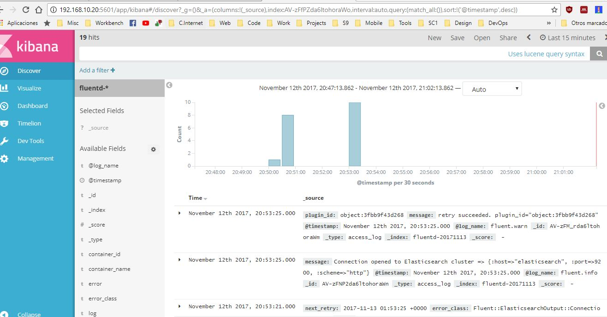

# Parcial 2 - Daniel Gutierrez A00320176

Repositorio: https://github.com/dgutierrez1/sd-exam2
 
## [PDF](https://github.com/dgutierrez1/sd-exam2/blob/A00320176/add-solution/Documento%20-%20Daniel%20Gutierrez%20A00320176.pdf)


Este repositorio es para solucionar: 

*`
Deberá	realizar	el	aprovisionamiento	de	un	ambiente	compuesto	por	los	siguientes	elementos:
En un servidor ejecutar: Un contenedor encargado de almacenar logs por medio de la aplicación Elasticsearch, un contenedor con la herramienta encargada de visualizar la información de los logs por medio de la aplicación Kibana.
En uno o varios servidores ejecutar: un contenedor web y un contenedor encargado de hacer la conversión de logs por medio de la aplicación Fluentd
`*

## Comandos de linux necesarios para el aprovisionamiento de los servicios solicitados

Instalar Java 
```
sudo apt-get update
sudo apt-get install openjdk-7-jre-headless --yes
```

**Instalar Elasticsearch**
```
sudo wget https://download.elasticsearch.org/elasticsearch/elasticsearch/elasticsearch-1.2.2.deb
sudo dpkg -i elasticsearch-1.2.2.deb
```

Iniciar Elasticsearch

```
sudo service elasticsearch start
```


**Instalar Kibana**
```
curl -L https://download.elasticsearch.org/kibana/kibana/kibana-3.1.0.tar.gz | tar xzf -
sudo cp -r kibana-3.1.0 /usr/share/
```

**Instalar Fluentd** usando td-agent package
```
wget http://packages.treasuredata.com/2/ubuntu/trusty/pool/contrib/t/td-agent/td-agent_2.0.4-0_amd64.deb
sudo dpkg -i td-agent_2.0.4-0_amd64.deb
```

Se debe instalar el plugin `out_elasticsearch` para Fluentd pueda enviar informacion a Elasticsearch

```
sudo apt-get install make libcurl4-gnutls-dev --yes
sudo /opt/td-agent/embedded/bin/fluent-gem install fluent-plugin-elasticsearch
```


Se debe configurar Fluentd para reciba los logs y los envie a Elastcsearch. Se debe cambiar el archivo `/etc/td-agent/td-agent.conf` asi:
```
<source>
  @type forward
  port 24224
  bind 0.0.0.0
</source>
<match *.**>
  @type copy
  <store>
    @type elasticsearch
    host elasticsearch
    port 9200
    logstash_format true
    logstash_prefix fluentd
    logstash_dateformat %Y%m%d
    include_tag_key true
    type_name access_log
    tag_key @log_name
    flush_interval 1s
  </store>
  <store>
    @type stdout
  </store>
</match>
```

Iniciar Fluentd

```
sudo service td-agent start
```


## Dockerfile de Fluentd

```Dockerfile

# fluentd/Dockerfile
FROM fluent/fluentd:v0.12-debian
RUN ["gem", "install", "fluent-plugin-elasticsearch", "--no-rdoc", "--no-ri", "--version", "1.9.2"]
```

## Docker-compose
`docker-compose.yml`
```yml
version: '2'
services:
  web:
    image: httpd:2.2.32
    ports:
      - "80:8080"
    links:
      - fluentd
    logging:
      driver: "fluentd"
     options:        fluentd-address: localhost:23223        tag: httpd.access

  fluentd:
    build: ./fluentd
    volumes:
      - ./fluentd/conf:/fluentd/etc
    links:
      - "elasticsearch"
    ports:
      - "23223:23223"
      - "23223:23223/udp"
    logging:
      driver: "json-file"

  elasticsearch:
    image: elasticsearch
    expose: 
      - 9200 
    ports:
      - "9200:9200"

  kibana:
    image: kibana
    links:
      - "elasticsearch"
    ports:
      - "5601:5601"
```

## Funcionamiento

Se puede ver que esta funcionando bien por los log recibidos por Kibana. Por problemas en mi maquina con Docker realice el ejercicio en una maquina virtual de ip `192.168.10.20`. 

Accediendo a `192.168.10.20:5601` se debe ver Kibana en funcionamiento



## Problemas y soluciones


Problema | Descripción |Solución
------------ | ------------- |  -------------
|Problema con los puertos ocupados de Fluentd|Al momento de iniciar el Fluentd se generaban errores porque ya habia puertos ocupados de la maquina | Busque varias opciones de imagenes de docker con diferentes configuraciones hasta que encontre una que no generaba el conflicto de puertos |
|Falla de Docker con Windows| Docker lanzaba errores cuando se iniciaba en Windows | Use una maquina virtual creada con Vagrant para poder realizar el parcial. Accedi a la maquina a traves de ssh y procedi a realizar todo el ejericio ahi.  |


